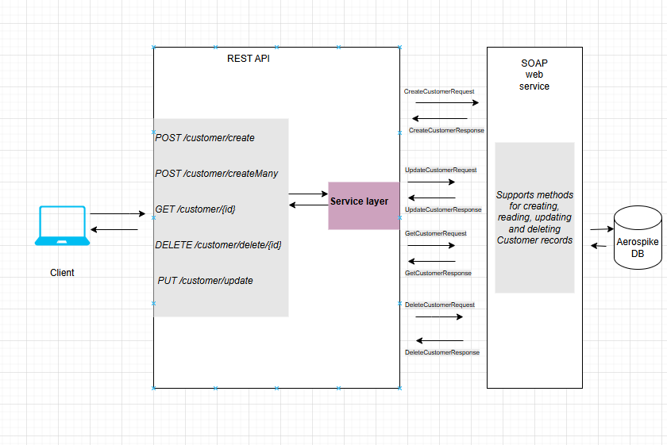

## Project Overview

### This project is divided into two primary components:
1. **SOAP Web Service**
2. **REST API Gateway**

---

### SOAP Web Service

The SOAP web service is responsible for handling core **CRUD operations** on customer data:
- Create
- Read
- Update
- Delete

These operations interact directly with the **Aerospike database** to manage customer records.

---

Endpoints are: 
>1. POST /customer/create
>2. POST /customer/createMany
>3. GET /customer/{id}
>4. DELETE /customer/delete/{id}
>5. PUT /customer/update


#### Key Responsibilities:
- Accepts RESTful HTTP requests
- Internally invokes corresponding SOAP operations
- Simplifies client interaction with the system

#### Additional Feature:
- **`POST /customer/createMany`**  
  A custom REST endpoint that allows **bulk creation of customers**. 
  This uses **`multi threading`** internally.
  This functionality is not available directly via the SOAP service and is handled exclusively at the REST layer.

---

### Request Flow
Client (REST) → REST API → SOAP Web Service → Aerospike DB


- The client communicates only with the REST API
- The REST API translates and forwards requests to the SOAP service
- The SOAP service performs business logic and data operations

 ##### Below image shows flow 



---

### Project Structure
1.REST
```
src
└── main
    └── java
        └── com.rest.demo
                    ├── config
                    │   ├── ExecutorConfig.java
                    │   └── SOAPConfig.java
                    ├── controller
                    │   └── CustomerController.java
                    ├── dto
                    │   ├── CustomerDTO.java
                    │   └── ListCreateDTO.java
                    ├── exceptions
                    │   └── GlobalExceptions.java
                    ├── service
                    │   └── SoapClientService.java
                    ├── util
                    │   ├── CustomerDTOToSOAPRequestConverter.java
                    │   └── Validator.java
                    └── DemoApplication.java
```
2. SOAP
```
src
└── main
    └── java
        └── com.soap
            ├── configuration
            │   ├── AerospikeConfig
            │   └── SOAPConfig
            ├── endpoint[readme.md](readme.md)
            │   └── CustomerEndpointSOAP
            ├── exceptions
            │   ├── UserAlreadyExistsException
            │   └── UserNotFoundException
            ├── model
            │   └── Customer
            ├── repository
            │   └── MyAerospikeRepository
            ├── service
            │   └── AerospikeService
            └── DemoApplication

```
>To run this project, make sure aerospike server is running on localhost with port 3000
#### Created by Saqib Ayoub


